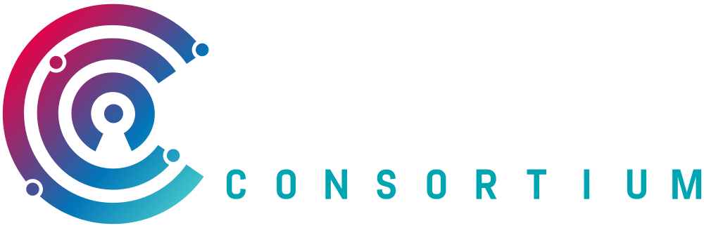
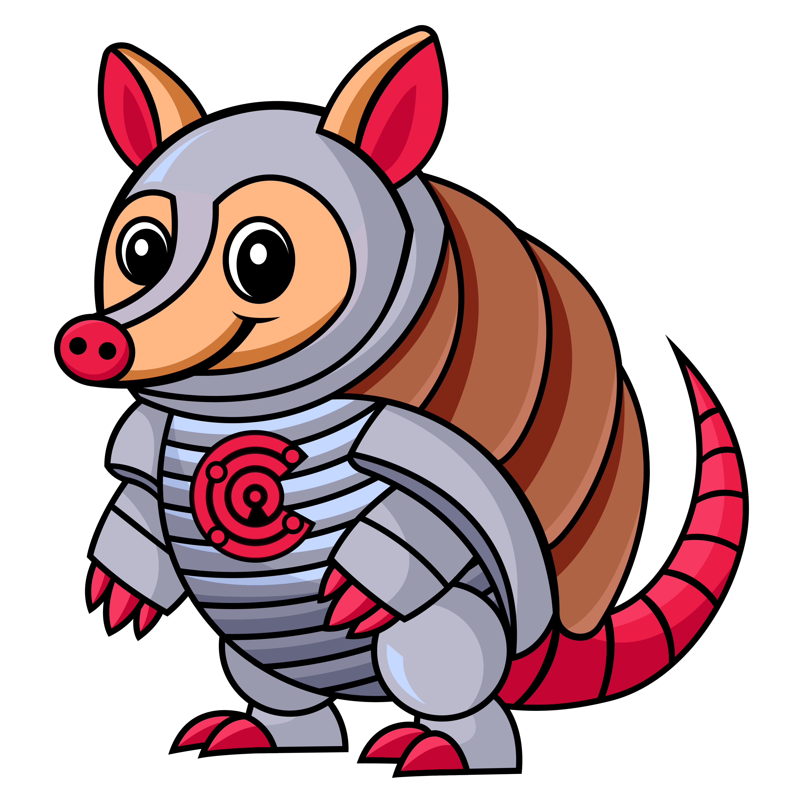
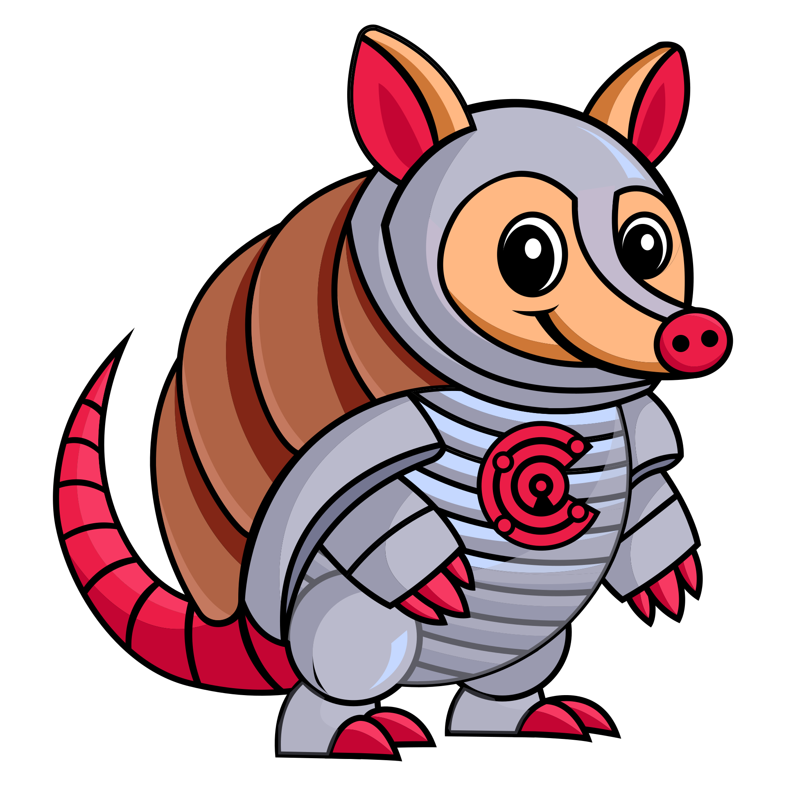

# Confidential Computing Consortium Artwork and Logos

*Note: GitHub Flavored Markdown used in the Readme doesn't support background colors. The white logos below are displayed on the light grey of tables.*

## Confidential Computing Consortium

* [Brand guidelines](https://github.com/confidential-computing/artwork/blob/main/CCC_NewBranding_BrandGuidelines.pdf)

### Color Palette

<table style="text-align:center">
	<tr>
		<th colspan=5>
	</tr>
	<tr>
		<th></th>
		<th width="150">RGB</th>
		<th width="150">CMYK</th>
		<th width="150">Pantone</th>
		<th width="150">Hex</th>
	</tr>
	<tr>
		<td></td>
		<td>(235, 0, 69)</td>
		<td>(0, 100, 0, 70)</td>
		<td>192C</td>
		<td>#00AF9A</td>
	</tr>
	<tr>
		<td></td>
		<td>(0, 117, 201)</td>
		<td>(100, 46, 2, 0)</td>
		<td>3005C</td>
		<td>#009ADE</td>
	</tr>
</table>

### Logos

<table>
    <tr>
    	<th colspan="7"></th>
    </tr>
    <tr>
        <th></th>
        <th colspan="3">PNG</th>
        <th colspan="3">SVG</th>
    </tr>
    <tr>
        <th></th>
        <th>horizontal</th>
        <th>stacked</th>
        <th>icon</th>
        <th>horizontal</th>
        <th>stacked</th>
        <th>icon</th>
    </tr>
    <tr>
        <th>color</th>
        <td></td>
        <td>&nbsp;</td>
        <td></td>
        <td></td>
        <td>&nbsp;</td>
        <td></td>
    </tr>
    <tr>
        <th>color (inverted)</th>
        <td></td>
        <td>&nbsp;</td>
        <td></td>
        <td></td>
        <td>&nbsp;</td>
        <td></td>
    </tr>
    <tr>
        <th>white</th>
        <td></td>
        <td>&nbsp;</td>
        <td></td>
        <td></td>
        <td>&nbsp;</td>
        <td></td>
    </tr>
    <tr>
        <th>black</th>
        <td></td>
        <td>&nbsp;</td>
        <td></td>
        <td></td>
        <td>&nbsp;</td>
        <td></td>
    </tr>
</table>

### CCC Committee Logos

<table>
    <tr>
        <th></th>
        <th>PNG</th>
        <th>SVG</th>
    </tr>
    <tr>
        <th>Attestation Special Interest Group</th>
        <td></td>
        <td></td>
    </tr>
    <tr>
        <th>Governance Risk Compliance Special Interest</th>
        <td></td>
        <td></td>
    </tr>
    <tr>
        <th>Linux Kernel Special Interest Group</th>
        <td></td>
        <td></td>
    </tr>
    <tr>
        <th>Outreach Committee</th>
        <td></td>
        <td></td>
    </tr>
    <tr>
        <th>Regulators and Standards SIG</th>
        <td></td>
        <td></td>
    </tr>
    <tr>
        <th>Technical Advisory Council</th>
        <td></td>
        <td></td>
    </tr>
    <tr>
        <th>Trustworthy Workload Identity SIG</th>
        <td></td>
        <td></td>
    </tr>
</table>

### CCC Mascot

<table>
    <tr>
        <th></th>
        <th>PNG</th>
        <th>SVG</th>
    </tr>
    <tr>
        <th>Armadillo Mascot (Left)</th>
        <td></td>
        <td></td>
    </tr>
    <tr>
        <th>Armadillo Mascot (Right)</th>
        <td></td>
        <td></td>
    </tr>
</table>

### Member Badge

<table>
    <tr>
        <th></th>
        <th>PNG</th>
        <th>SVG</th>
    </tr>
    <tr>
        <th>Horizontal</th>
        <td></td>
        <td></td>
    </tr>
    <tr>
        <th>Vertical</th>
        <td></td>
        <td></td>
    </tr>
</table>

### Font

The CCC font is [Abel Pro Bold](./ccc/other/abel-pro.zip), available under the Open Font License.

## CCC Projects Logos

## Coconut SVSM

### Logos

<table>
    <tr>
        <th></th>
        <th>SVG</th>
    </tr>
    <tr>
        <th>Icon 1</th>
        <td></td>
    </tr>
    <tr>
        <th>Icon 2</th>
        <td></td>
    </tr>
    <tr>
        <th>Icon 3</th>
        <td></td>
    </tr>
    <tr>
        <th>Logo 1</th>
        <td></td>
    </tr>
    <tr>
        <th>Logo 2</th>
        <td></td>
    </tr>
    <tr>
        <th>Logo 3</th>
        <td></td>
    </tr>
    <tr>
        <th>Logo 4</th>
        <td></td>
    </tr>
    <tr>
        <th>Logo 5</th>
        <td></td>
    </tr>
</table>

## Dstack

### Color Palette

<table style="text-align:center">
	<tr>
		<th colspan=5>
	</tr>
	<tr>
		<th></th>
		<th width="150">RGB</th>
		<th width="150">CMYK</th>
		<th width="150">Pantone</th>
		<th width="150">Hex</th>
	</tr>
	<tr>
		<td></td>
		<td>(205, 250, 80)</td>
		<td>(33, 4, 75, 0)</td>
		<td>2297 C</td>
		<td>#CDFA50</td>
	</tr>
</table>

### Logos

<table>
    <tr>
    	<th colspan="7"></th>
    </tr>
    <tr>
        <th></th>
        <th colspan="3">PNG</th>
        <th colspan="3">SVG</th>
    </tr>
    <tr>
        <th></th>
        <th>horizontal</th>
        <th>vertical</th>
        <th>icon</th>
        <th>horizontal</th>
        <th>vertical</th>
        <th>icon</th>
    </tr>
    <tr>
        <th>color</th>
        <td></td>
        <td></td>
        <td></td>
        <td></td>
        <td></td>
        <td></td>
    </tr>
    <tr>
        <th>black</th>
        <td></td>
        <td></td>
        <td></td>
        <td></td>
        <td></td>
        <td></td>
    </tr>
</table>

### Font

The dstack font is [Montserrat](https://github.com/JulietaUla/Montserrat/tree/master), available under the SIL Open Font License, Version 1.1.

## Enarx

### Logos

<table>
    <tr>
    	<th colspan="7"></th>
    </tr>
    <tr>
        <th></th>
        <th colspan="3">PNG</th>
        <th colspan="3">SVG</th>
    </tr>
    <tr>
        <th></th>
        <th>horizontal</th>
        <th>stacked</th>
        <th>icon</th>
        <th>horizontal</th>
        <th>stacked</th>
        <th>icon</th>
    </tr>
    <tr>
        <th>black</th>
        <td></td>
        <td></td>
        <td></td>
        <td></td>
        <td></td>
        <td></td>
    </tr>
    <tr>
        <th>white</th>
        <td></td>
        <td></td>
        <td></td>
        <td></td>
        <td></td>
        <td></td>
    </tr>
</table>

### Font

The Enarx font is [Roboto Regular](https://fonts.google.com/specimen/Roboto?preview.text=Enarx&preview.text_type=custom).

## Gramine Project

### Color Palette

<table style="text-align:center">
	<tr>
		<th colspan=5>
	</tr>
	<tr>
		<th></th>
		<th width="150">RGB</th>
		<th width="150">CMYK</th>
		<th width="150">Pantone</th>
		<th width="150">Hex</th>
	</tr>
	<tr>
		<td></td>
		<td>(221, 42, 124)</td>
		<td>(0, 81, 44, 13)</td>
		<td>213C</td>
		<td>#DD2A7C</td>
	</tr>
</table>

### Logos

<table>
    <tr>
    	<th colspan="7"></th>
    </tr>
    <tr>
        <th></th>
        <th colspan="3">PNG</th>
        <th colspan="3">SVG</th>
    </tr>
    <tr>
        <th></th>
        <th>horizontal</th>
        <th>stacked</th>
        <th>icon</th>
        <th>horizontal</th>
        <th>stacked</th>
        <th>icon</th>
    </tr>
    <tr>
        <th>color</th>
        <td></td>
        <td></td>
        <td></td>
        <td></td>
        <td></td>
        <td></td>
    </tr>
    <tr>
        <th>color (inverted)</th>
        <td></td>
        <td></td>
        <td></td>
        <td></td>
        <td></td>
        <td></td>
    </tr>
    <tr>
        <th>black</th>
        <td></td>
        <td></td>
        <td></td>
        <td></td>
        <td></td>
        <td></td>
    </tr>
    <tr>
        <th>white (black background)</th>
        <td></td>
        <td></td>
        <td></td>
        <td></td>
        <td></td>
        <td></td>
    </tr>
    <tr>
        <th>white</th>
        <td></td>
        <td></td>
        <td></td>
        <td></td>
        <td></td>
        <td></td>
    </tr>

</table>

### Font

The Gramine font is [Open Sans Light](https://fonts.google.com/specimen/Open+Sans?preview.text=GRAMINE&preview.text_type=custom).

## Islet

### Logos

<table>
    <tr>
        <th></th>
        <th>SVG</th>
    </tr>
    <tr>
        <th>Logo</th>
        <td></td>
    </tr>
    <tr>
        <th>Logo with Title</th>
        <td></td>
    </tr>
</table>

## Manatee

### Logos

<table>
    <tr>
        <th></th>
        <th>PNG</th>
        <th>SVG</th>
    </tr>
    <tr>
        <th>Color</th>
        <td></td>
        <td></td>
    </tr>
    <tr>
        <th>Black</th>
        <td></td>
        <td></td>
    </tr>
    <tr>
        <th>White</th>
        <td></td>
        <td></td>
    </tr>
</table>

## Occlum

### Color Palette

<table style="text-align:center">
	<tr>
		<th colspan=5>
	</tr>
	<tr>
		<th></th>
		<th width="150">RGB</th>
		<th width="150">CMYK</th>
		<th width="150">Pantone</th>
		<th width="150">Hex</th>
	</tr>
	<tr>
		<td></td>
		<td>(0, 116, 229)</td>
		<td>(90, 44, 0, 10)</td>
		<td>285 C</td>
		<td>#0074E5</td>
	</tr>
</table>

### Logos

<table>
    <tr>
    	<th colspan="7"></th>
    </tr>
    <tr>
        <th></th>
        <th colspan="3">PNG</th>
        <th colspan="3">SVG</th>
    </tr>
    <tr>
        <th></th>
        <th>horizontal</th>
        <th>stacked</th>
        <th>icon</th>
        <th>horizontal</th>
        <th>stacked</th>
        <th>icon</th>
    </tr>
    <tr>
        <th>color (reverse)</th>
        <td></td>
        <td></td>
        <td></td>
        <td></td>
        <td></td>
        <td></td>
    </tr>
    <tr>
        <th>color</th>
        <td></td>
        <td></td>
        <td></td>
        <td></td>
        <td></td>
        <td></td>
    </tr>
    <tr>
        <th>white (black background)</th>
        <td></td>
        <td></td>
        <td></td>
        <td></td>
        <td></td>
        <td></td>
    </tr>
    <tr>
        <th>black</th>
        <td></td>
        <td></td>
        <td></td>
        <td></td>
        <td></td>
        <td></td>
    </tr>
    <tr>
        <th>white</th>
        <td></td>
        <td></td>
        <td></td>
        <td></td>
        <td></td>
        <td></td>
    </tr>
</table>

## Open Enclave SDK

### Logos

<table>
    <tr>
        <th></th>
        <th>SVG</th>
    </tr>
    <tr>
        <th>Icon - Color</th>
        <td></td>
    </tr>
</table>

## Veracruz

### Color Palette

<table style="text-align:center">
	<tr>
		<th colspan=5>
	</tr>
	<tr>
		<th></th>
		<th width="150">RGB</th>
		<th width="150">CMYK</th>
		<th width="150">Pantone</th>
		<th width="150">Hex</th>
	</tr>
	<tr>
		<td></td>
		<td>(28, 121, 183)</td>
		<td>(85, 34, 0, 28)</td>
		<td>7690C</td>
		<td>#1C79B7</td>
	</tr>
	<tr>
		<td></td>
		<td>(3, 36, 76)</td>
		<td>(96, 53, 0, 70)</td>
		<td>655C</td>
		<td>#03244C</td>
	</tr>
</table>

### Logos

<table>
    <tr>
    	<th colspan="7"></th>
    </tr>
    <tr>
        <th></th>
        <th colspan="3">PNG</th>
        <th colspan="3">SVG</th>
    </tr>
    <tr>
        <th></th>
        <th>horizontal</th>
        <th>stacked</th>
        <th>icon</th>
        <th>horizontal</th>
        <th>stacked</th>
        <th>icon</th>
    </tr>
    <tr>
        <th>color</th>
        <td></td>
        <td></td>
        <td></td>
        <td></td>
        <td></td>
        <td></td>
    </tr>
    <tr>
        <th>color (reverse)</th>
        <td></td>
        <td></td>
        <td></td>
        <td></td>
        <td></td>
        <td></td>
    </tr>
    <tr>
        <th>white (black background)</th>
        <td></td>
        <td></td>
        <td></td>
        <td></td>
        <td></td>
        <td></td>
    </tr>
    <tr>
        <th>black</th>
        <td></td>
        <td></td>
        <td></td>
        <td></td>
        <td></td>
        <td></td>
    </tr>
    <tr>
        <th>white</th>
        <td></td>
        <td></td>
        <td></td>
        <td></td>
        <td></td>
        <td></td>
    </tr>
</table>

## Veraison

### Logos

<table>
    <tr>
        <th></th>
        <th>SVG</th>
    </tr>
    <tr>
        <th>Logo</th>
        <td></td>
    </tr>
</table>

## Virtee

### Logos

<table>
    <tr>
        <th></th>
        <th>PNG</th>
        <th>SVG</th>
    </tr>
    <tr>
        <th>Logo - Color</th>
        <td></td>
        <td></td>
    </tr>
    <tr>
        <th>Logo</th>
        <td>&nbsp;</td>
        <td></td>
    </tr>
</table>

---

The Confidential Computing Consortium's trademarks are managed by LF Projects, LLC. Use of any trademark or logo is subject to the trademark policy available at [lfprojects.org/policies/trademark-policy](https://lfprojects.org/policies/trademark-policy/).

Please email [info@confidentialcomputing.io](mailto:info@confidentialcomputing.io) with any questions or requests.
